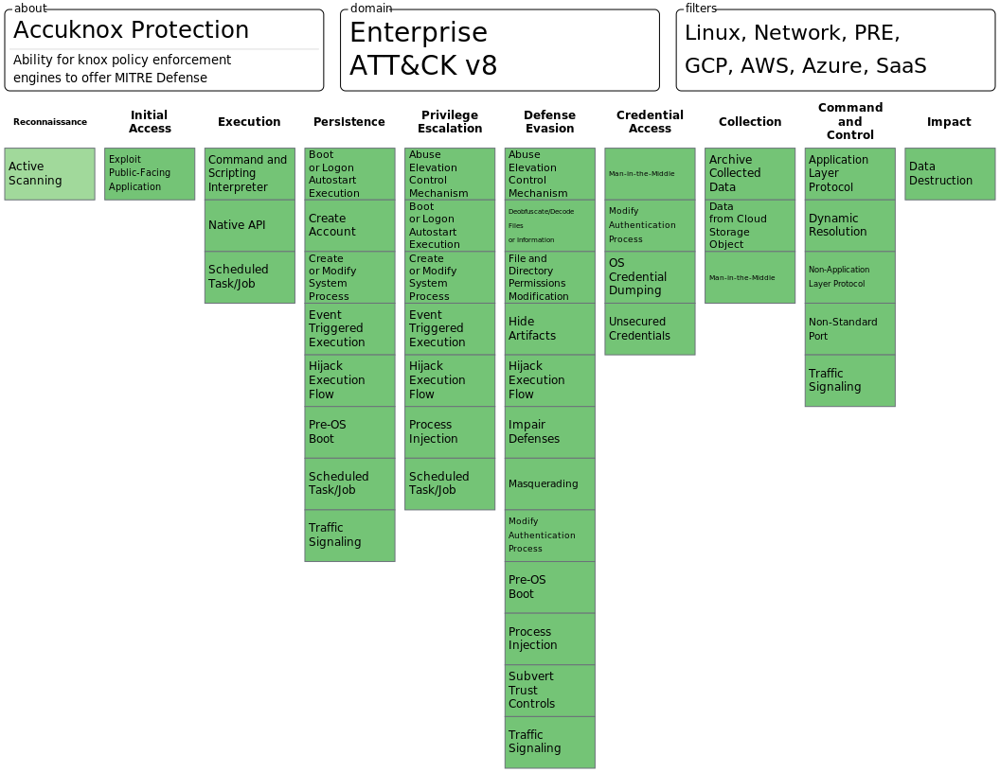

# MITRE Framework policy mapping

The first level folder points to MITRE Tactic. The second level folder points
to corresponding MITRE Techniques. The next level folders are the
sub-techniques.

```text
├── Reconnaissance
│   └── Active Scanning
│       ├── README.md
│       └── Scanning IP Blocks
│           ├── kubearmor1.yaml
│           ├── kubearmor2.yaml
│           └── README.md

```

## MITRE Tactics rules covered


## Checklist one must keep in mind before formulating rules

### Is the rule specific enough to avoid too many false positives?

The best rules are those which can be generically applied. Thus as far as
possible provide all the context for the rule. For e.g, if there is a
configuration file, specify which processes access that file, also specify
whether access is at host level or from container.

A Bad example could be:

	Restrict exposure of /var/run/docker.sock to other containers.

This is a bad example because restricting access of the sock file to general
containers will break things in regular k8s env. The access to the
`/var/run/docker.sock` should be restricted to processes/daemons such as
dockerd (Not sure if dockerd is the only process which needs access to
`/var/run/docker.sock`).  A rule should clearly state either the process spec
or the container spec or host which could access a given object and what could
be the exception rules.

A good example could be:

	Restrict exposure to /var/run/docker.sock. Allow access only from following processes {dockerd, xyz, abc}.

Identifying this set of processes is a key problem to handle while defining
the rules. Note that the same could be extended to what processes or
containers need access to what configuration files.
